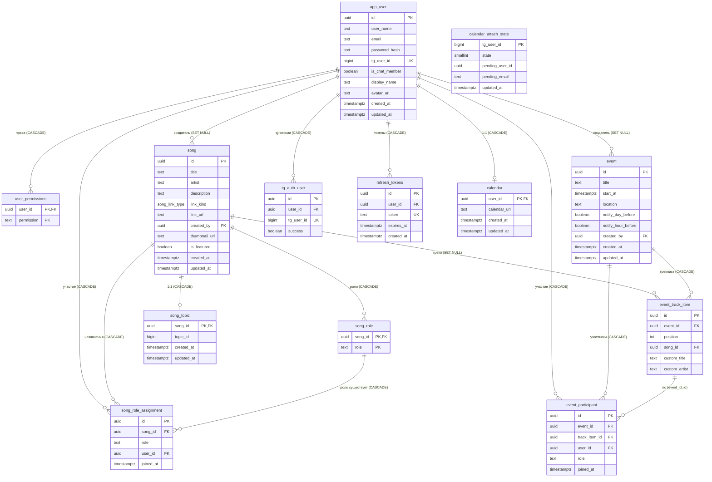

# ER-схема приложения Music Club

Схема описывает текущую структуру базы данных (PostgreSQL), формируемую EF Core 10 из флюент-конфигураций в `src/Infrastructure/Data/Configurations/`.

- Таблицы домена — в snake_case, единственное число (`song`, `song_role`).
- UUID-первичные ключи: `gen_random_uuid()`; метки времени — `NOW()`.
- `link_kind` — enum PostgreSQL `song_link_type` (`youtube` | `yandex_music` | `soundcloud`).
- **Единая модель пользователя — самописная (без ASP.NET Identity).** `ApplicationUser` (`src/Domain/Entities/`) маппится в таблицу `app_user` (повторяет go-based схему) и хранит `UserName`, `Email`, `PasswordHash`, `TgUserId`, `IsChatMember`, `DisplayName`, `AvatarUrl`, `CreatedAt`/`UpdatedAt`.
- **Гранулярные права — таблица `user_permissions`** (`user_id`, `permission`), по строке на право. Значения: `participation.edit_own`, `participation.edit_any`, `songs.edit_own`, `songs.edit_any`, `songs.edit_featured`, `events.edit`, `tracklists.edit`. Роли (`Administrator`, `Roadie`, `Default`) — «сахар», материализующий набор прав в этой таблице.

## Mermaid-диаграмма

## Таблицы

### app_user (ApplicationUser)
Единая сущность пользователя приложения. Самописная (без ASP.NET Identity), повторяет go-based схему. Guid PK.

| Колонка | Тип | Примечание |
|---|---|---|
| `Id` | uuid PK | Guid-ключ |
| `UserName` | text | |
| `Email` | text | |
| `PasswordHash` | text | legacy-логин, UI не использует |
| `TgUserId` | bigint | уникальный (`idx_application_user_tg_user_id`), связь с Telegram |
| `IsChatMember` | boolean | default `false` |
| `DisplayName` | text | default `""` |
| `AvatarUrl` | text | |
| `CreatedAt` / `UpdatedAt` | timestamptz | default `NOW()` |

### user_permissions
Гранулярные права пользователя: одна строка на право. Составной PK `(user_id, permission)`, FK `user_id` → `app_user.Id` с CASCADE. Значения `permission`: `participation.edit_own`, `participation.edit_any`, `songs.edit_own`, `songs.edit_any`, `songs.edit_featured`, `events.edit`, `tracklists.edit`. Роли (`Administrator`, `Roadie`, `Default`) — «сахар», материализующий набор прав в этой таблице. Новым пользователям выдаются `songs.edit_own` + `participation.edit_own`.

### song
Песня. FK `created_by` → `app_user.Id` с `ON DELETE SET NULL`.

### song_role
Роль для песни. Составной PK `(song_id, role)`. FK → `song.id` с CASCADE.

### song_role_assignment
Назначение пользователя на роль песни. FK `(song_id, role)` → `song_role(song_id, role)` (`song_role_exists`, CASCADE) — назначение возможно только на существующую роль. Уникальность `(song_id, role, user_id)`.

### event
Событие. FK `created_by` → `app_user.Id` с `SET NULL`. Индекс `idx_event_start_at`.

### event_track_item
Пункт треклиста события. Ограничение `track_item_requires_title`: `song_id IS NOT NULL OR custom_title IS NOT NULL`. Уникальность `(event_id, position)`. Альтернативный ключ `(event_id, id)` (`track_item_identity`) — по нему ссылаются участники.

### event_participant
Участие пользователя в событии на роли (возможно, на конкретном треке). FK `(event_id, track_item_id)` → `event_track_item(event_id, id)` (`fk_event_participant_track_item`, CASCADE). Уникальность `(event_id, role, user_id, track_item_id)` (`uniq_event_participation`).

### tg_auth_user
Сессия подтверждения Telegram-авторизации (для потока `/start auth_<uuid>`). FK `user_id` → `app_user.Id` с CASCADE. `tg_user_id` уникален.

### refresh_tokens
Ротируемые refresh-токены. FK `user_id` → `app_user.Id` с CASCADE. `token` уникален.

### song_topic
Связь песни с топиком Telegram-канала (1:1). FK → `song.id` с CASCADE. `topic_id` не уникален (индекс `idx_song_topic_topic_id`).

### calendar
Ссылка на ICS-календарь пользователя (1:1). FK `user_id` → `app_user.Id` с CASCADE.

### calendar_attach_state
Состояние машины состояний бота при привязке календаря (short state 1/2/3). PK — `tg_user_id`. FK на пользователя нет (связь по `tg_user_id`).

## Сводка связей

| От | К | FK | On delete |
|---|---|---|---|
| user_permissions | app_user | `user_id` | CASCADE |
| song | app_user | `created_by` | SET NULL |
| song_role | song | `song_id` | CASCADE |
| song_role_assignment | song | `song_id` | CASCADE |
| song_role_assignment | app_user | `user_id` | CASCADE |
| song_role_assignment | song_role | `(song_id, role)` | CASCADE |
| event | app_user | `created_by` | SET NULL |
| event_track_item | event | `event_id` | CASCADE |
| event_track_item | song | `song_id` | SET NULL |
| event_participant | event | `event_id` | CASCADE |
| event_participant | event_track_item | `(event_id, track_item_id)` | CASCADE |
| event_participant | app_user | `user_id` | CASCADE |
| song_topic | song | `song_id` | CASCADE |
| calendar | app_user | `user_id` | CASCADE |
| tg_auth_user | app_user | `user_id` | CASCADE |
| refresh_tokens | app_user | `user_id` | CASCADE |

## Примечания
- `calendar_attach_state` не имеет FK на пользователя (связь по `tg_user_id`).
- Enum `song_link_type` маппится в Npgsql через `MapEnum<SongLinkType>()`.
- Dev-база создаётся через `EnsureDeletedAsync` + `EnsureCreatedAsync` (миграции не применяются).
